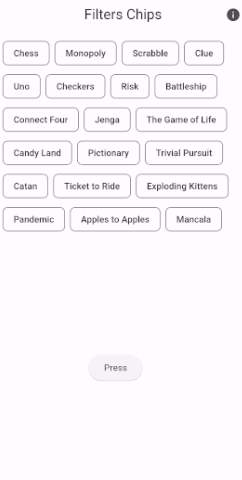

# Filter Chips

   
Create an Filter Chips in Flutter.
### ✌&ensp;Preview

|              App Preview             |
| :----------------------------------: |
| </a> |

### ⚡&ensp;Social Media

&ensp;Instagram: [@SyedUzairHassan](https://www.instagram.com/syed_uzair1113 "Instagram Syed Uzair Hassan")

&ensp;Facebook: [@SyedUzairHassan](https://www.facebook.com/syeduzairdev "Facebook Syed Uzair Hassan")

&ensp;LinkedIn: [@SyedUzairHassan](https://www.linkedin.com/in/syeduzairdev/ "LinkedIn Syed Uzair Hassan")

&ensp;GitHub: [@SyedUzairHassan](https://github.com/syeduzairdev "GitHub Syed Uzair Hassan")

&ensp;Website: [@SyedUzairHassan](https://uzairhassan.com "Website Syed Uzair Hassan")

